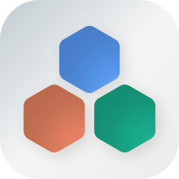
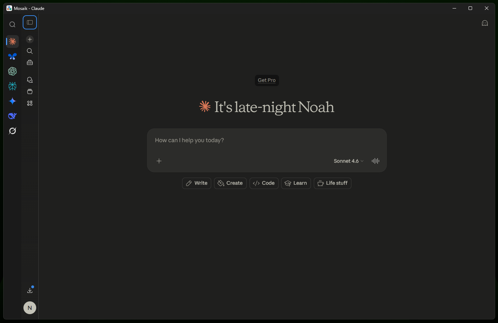
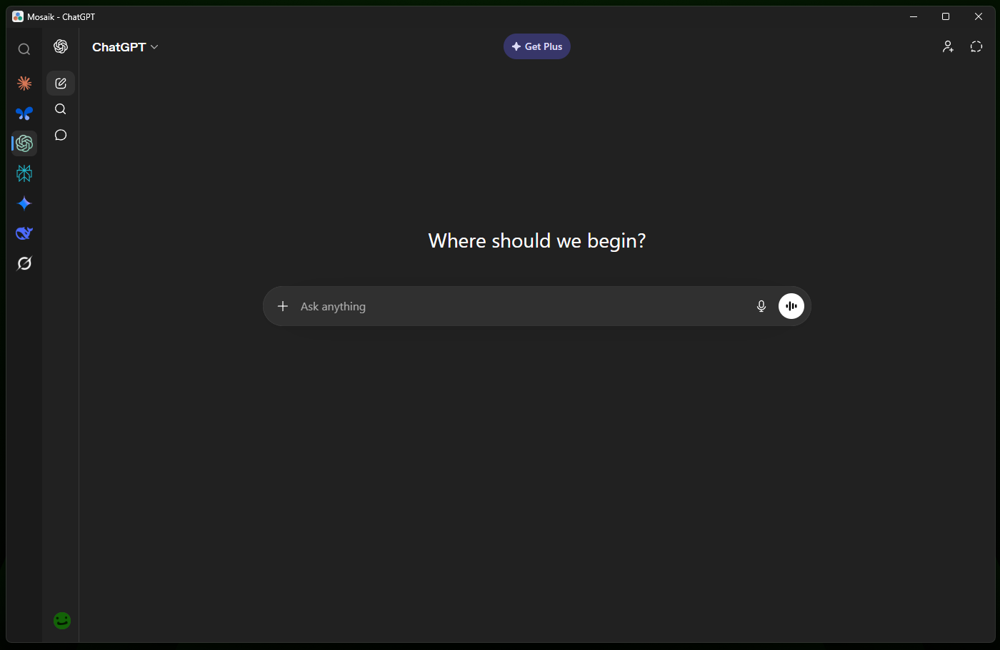

<div align="center">
  
  <h1>Mosaik</h1>

  <p><strong>Desktop command center for AI services</strong></p>

  <p>
    
    
    
    
  </p>
</div>

---

Mosaik runs in your system tray. Press `Ctrl+Space`, type an AI service name, and hit Enter. The app launches or switches to that service instantly. No browser tabs, no clutter.

## What it does

**Command palette**
- Global frameless overlay (`Ctrl+Space`)
- Type an AI name → Enter launches or switches

**Window management**
- Single instance lock, no duplicate processes or tray icons
- Right-click menus for Copy, Paste, Inspect Element
- External links open in your default browser

**Session isolation**

| Mode | Behavior |
| :--- | :--- |
| **Global** | Share cookies across services. Log into Google once for Gemini and AI Studio. |
| **Private** | Each service gets its own cookie jar. Run Work ChatGPT and Personal ChatGPT side by side. |

**Performance**
- Unloads inactive AI models from RAM
- Custom User-Agent (Chrome 120/Electron 28) and `webdriver` spoofing
- Hides website scrollbars and navigation sidebars via CSS injection

## Where data lives

| Platform | Path |
| :--- | :--- |
| **Windows** | `%APPDATA%/roaming/mosaik` |

Contains `services.json`, assets folder, and session partitions. Mosaik never sends your cookies or credentials to any server.

## Command line

| Argument | Effect |
| :--- | :--- |
| `--startup` | Launches to system tray without opening a window |

## Install

**Requirements**
- [Node.js](https://nodejs.org/) (v18 or higher)

```bash
git clone https://github.com/noahain/mosaik
cd mosaik
npm install
npm run dev
```

## Build executable

```bash
npm run dist
```

The installer appears in `dist/`. The build uses `assets/icons/icon.ico`.

## Screenshots

<table>
  <tr>
    <td align="center"><br/><sub>Claude in Mosaik</sub></td>
    <td align="center"><br/><sub>ChatGPT in Mosaik</sub></td>
  </tr>
</table>

## Tech stack

Electron · BrowserView · IPC · Node.js

## Development team

- **Lead:** Noahain - product design, security bypassing, logic direction
- **Primary developer:** Claude Code (Kimi K2.5) - BrowserView architecture, IPC bridging
- **Technical consultant:** Gemini 3 Flash - debugging, stealth strategy, oversight

## License

MIT
