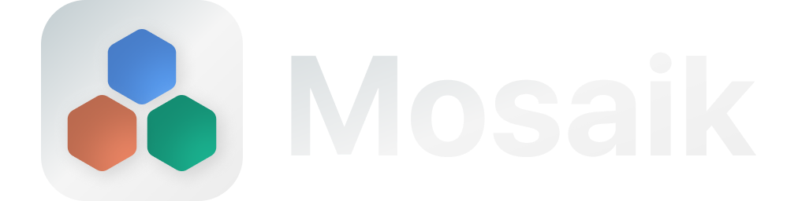

**Mosaik** is a high-performance, privacy-focused desktop "Command Center" for AI services. It unifies the world's most powerful AI models into a single, sleek desktop interface, eliminating tab clutter and providing "Spotlight-style" access to intelligence.

## 🚀 Advanced Features

### 🧠 Intelligent UX
- **Command Palette (`Ctrl+Space`)**: A global, frameless search overlay. Type an AI name and hit Enter to launch or switch instantly.
- **Smart Window Management**: 
  - **Single Instance Lock**: Prevents duplicate processes or multiple tray icons.
  - **Bridge Window Login**: Automatically detects Google "insecure browser" blocks and opens a trusted "Bridge Window" to bypass security gates.
- **Native Context Menus**: Right-click support for Copy, Paste, and Inspect Element within AI views.
- **External Link Interception**: Links to help docs or external sites automatically open in your system's default browser (Chrome/Edge), keeping Mosaik focused on chat.

### 🔒 Privacy & Persistence
- **Hybrid Session Isolation**:
  - **Global Mode**: Share cookies across services (Log into Google once for Gemini and AI Studio).
  - **Private Mode**: Every service gets its own isolated "cookie jar"—perfect for managing multiple accounts on the same platform (e.g., Work ChatGPT vs. Personal ChatGPT).
- **Persistent Storage**: All configurations and sessions are stored in the user's data directory (`%APPDATA%`), surviving app updates and reinstalls.

### 📂 Data & Privacy
Mosaik is designed to be self-contained and private. On the first launch, the app initializes a workspace in your system's protected data directory:
- **Windows:** `%APPDATA%/roaming/mosaik`

This folder contains your `services.json` (configuration), assets folder and isolated session partitions. **Mosaik never sends your cookies or credentials to any external server;** they stay strictly on your local machine.

### ⚡ Performance & Polish
- **Memory Purge**: Unloads inactive AI models from RAM unless marked as "Always Loaded."
- **Stealth Mode**: Custom User-Agent matching (Chrome 120/Electron 28) and `webdriver` spoofing to bypass bot detection.
- **Chromeless UI**: Custom CSS injection to hide website scrollbars and original navigation sidebars for a truly native feel.

---

## 🛠️ Command Line Arguments

Mosaik supports a specialized startup mode for power users:

| Argument | Description |
| :--- | :--- |
| `--startup` | Launches Mosaik directly to the system tray. No window will appear until you use the shortcut or click the tray icon. Perfect for your "Startup Folder." |

---

## 📥 Installation

### 1. Prerequisites
Ensure you have [Node.js](https://nodejs.org/) (v18 or higher) installed on your system.

### 2. Setup
```bash
# Clone the repository
git clone https://github.com/noahain/mosaik

# Enter the project folder
cd mosaik

# Install dependencies
npm install

# Run in development mode
npm run dev
```

---

## 📦 Building the Executable (.EXE)

To package Mosaik into a standalone Windows application:

1. **Build the assets:**
   ```bash
   npm run dist
   ```
2. **Locate your app:** The installer will be generated in the `dist/` folder.
3. **Icons:** The build uses the high-res multi-resolution `icon.ico` located in `assets/icons/` to ensure the taskbar and desktop icons look sharp at all sizes.

---

## 🤖 Agentic Development (The Story)

Mosaik is a product of **Human-AI Collaboration**. 
- **Lead Architect:** Noahain (Product Design, Security Bypassing, Logic Direction)
- **Primary Developer:** **Claude Code** (Powered by **Kimi K2.5**) - Handled the heavy lifting of Electron's `BrowserView` architecture and IPC bridging.
- **Technical Consultant:** **Gemini 3 Flash** - Provided deep-level debugging, stealth strategy, and project oversight.

This project demonstrates the power of **Agentic Workflows**, where a single human can direct multiple AI sub-agents to build production-ready software in record time.

---

## ⚖️ License & Disclaimer
Mosaik is an independent project and is not affiliated with OpenAI, Anthropic, or Google. It is a specialized browser shell designed for productivity. Use at your own risk.

**License:** MIT 

Built with ❤️ and Artificial Intelligence.
